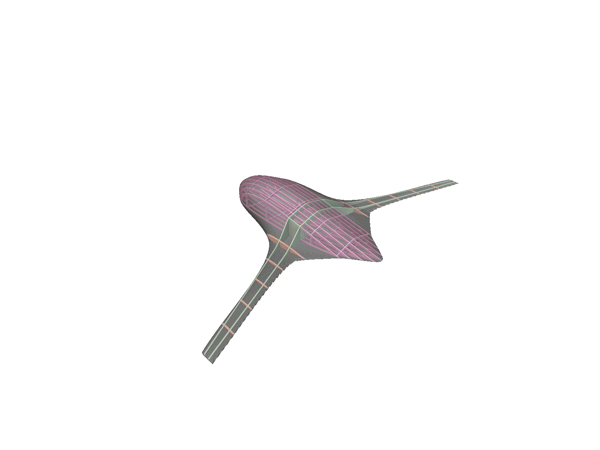
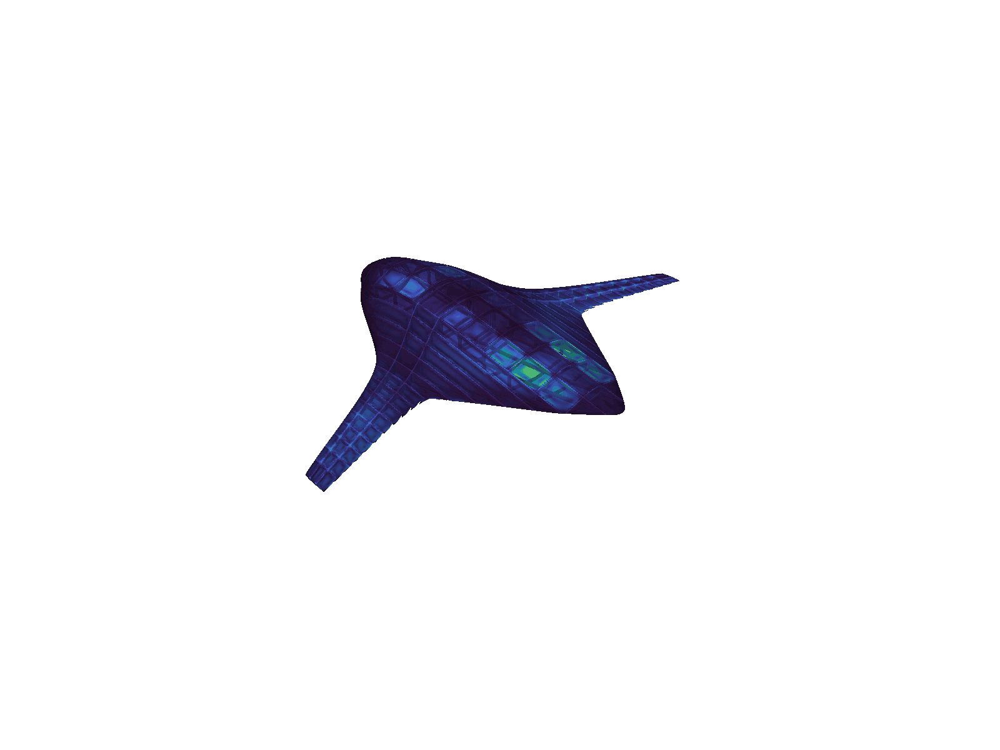

# BWB Inverse Design — Dataset & Forward Surrogate Models

**AI-Driven Multidisciplinary Design Optimization — nTop × MIT DeCoDE Lab**

This repository bundles the **data and forward models** for the Blended-Wing-Body
(BWB) structural inverse-design challenge: given a mission profile and structural
constraints, find the **lightest internal structure and external planform** whose
stress stays under the allowable while hitting a target lift-to-drag ratio and
meeting payload/fuel volume.

It provides the three ingredients a participant builds an inverse pipeline on top of:

| Provided artifact | Where it lives here |
|---|---|
| **Structures dataset** (13,720 FE designs) | [`data/bwb_structures_dataset.csv`](data/bwb_structures_dataset.csv) |
| **Forward surrogates** — integrated `L/D` and field-resolved surface aero | [`models/ld_surrogate/`](models/ld_surrogate/) · [`models/filmnet/`](models/filmnet/) |
| **Parameterized nTop implicit model** | [`ntop_model/`](ntop_model/) *(drop the `.ntop` file here)* |

---

## Visualizations

**Parameterized internal structure** — the nTop implicit model adapts rib/spar
frequencies and shell thicknesses as the external mold line changes:



**Finite-element stress field** — each design is solved under the mapped
aerodynamic + inertial loads; the label is a hot-spot stress read off this field:



---

## Repository layout

```
bwb-inverse-design/
├── data/
│   └── bwb_structures_dataset.csv      # 13,720 designs × (24 params + 4 outputs)
├── models/
│   ├── ld_surrogate/                   # geometry + flight -> CL, CD, L/D  (pure NumPy)
│   │   ├── predict_ld.py               #   -> start here: predict_ld(geom, alt, kcas, aoa)
│   │   ├── regressor.py, reg_full.json, reg_feasible.json
│   │   ├── flight_conversion.py, aero_design_space.json
│   │   └── README.md
│   └── filmnet/                        # field-resolved surface aero  (PyTorch)
│       ├── film_model_v1.py, checkpoints/film_best.pth, norm_stats.json
│       ├── filmnet_point_map_export.py, filmnet_direct_stl.py
│       └── README.md
├── ntop_model/                         # (empty) parameterized nTop implicit model goes here
├── assets/                             # visualizations used in this README
├── requirements.txt
└── README.md
```

---

## The dataset

`data/bwb_structures_dataset.csv` — **13,720** finite-element designs, one per row.
Each row is a full BWB design (external planform + internal structure) at a flight
condition, with the resulting mass, volumes, and peak stress. **28 columns = 24
input parameters + 4 outputs.**

### Inputs (24)

The 24 parameters are 10 planform-geometry variables, 3 flight-condition variables,
and 11 internal-structure variables. Ranges below are the actual min/max in the
shipped data.

**Geometry — planform (nTop ratios)**

| Parameter | Description | Unit | Min | Max |
|---|---|---|---:|---:|
| `C2/C1` | chord ratio (station 2 / root) | – | 0.55 | 0.85 |
| `C3/C1` | chord ratio (station 3 / root) | – | 0.18 | 0.28 |
| `C4/C1` | chord ratio (tip / root) | – | 0.06 | 0.09 |
| `B1/C1` | span-fraction parameter 1 | – | 0.1 | 0.2 |
| `B2/C1` | span-fraction parameter 2 | – | 0.0501 | 0.2 |
| `B3/C1` | span-fraction parameter 3 | – | 0.35 | 0.7 |
| `X3/C1` | outboard break streamwise fraction | – | 0.5 | 0.65 |
| `S1` | inboard sweep angle | deg | 40 | 60 |
| `S3` | outboard sweep angle | deg | 20 | 40 |
| `C1` | root chord (scale) | mm | 2500 | 4000 |

**Flight condition (mission)**

| Parameter | Description | Unit | Min | Max |
|---|---|---|---:|---:|
| `Altitude` | altitude | kft | 0.001493 | 18 |
| `KCAS` | calibrated airspeed | kt | 33.02 | 250 |
| `AOA` | angle of attack | deg | -7.999 | 16 |

**Structure (nTop implicit)**

| Parameter | Description | Unit | Min | Max |
|---|---|---|---:|---:|
| `Skin Thickness` | skin shell thickness | m | 0.0003004 | 0.004994 |
| `Front Spar Chord %` | front spar chordwise position | frac | 0.18 | 0.35 |
| `Rear Spar Chord %` | rear spar chordwise position | frac | 0.55 | 0.75 |
| `Spar Thickness` | spar shell thickness | m | 0.0009761 | 0.007997 |
| `# of Ribs` | wing rib count (integer) | – | 3 | 14 |
| `Rib Thickness` | rib shell thickness | m | 0.0015 | 0.01499 |
| `Wingbox Cutout` | wingbox cutout fraction | frac | 0.01 | 0.04995 |
| `# of Fuselage Ribs` | fuselage rib count (integer) | – | 3 | 11 |
| `# of Fuselage Spars` | fuselage spar count (integer) | – | 3 | 12 |
| `Fuselage Struct Thickness` | fuselage member thickness | m | 0.002 | 0.02499 |
| `Fuselage Struct Width` | fuselage member width | m | 0.001038 | 0.01499 |

### Outputs (4)

| Column | Meaning | Unit |
|---|---|---|
| `Aircraft Empty Weight` | structural mass to minimize | kg |
| `Payload Volume` | internal payload volume achieved | mm³ *(÷1e9 → m³)* |
| `Fuel Volume` | internal fuel volume achieved | mm³ *(÷1e9 → m³)* |
| `stress` | **hot-spot stress** (feasibility label) | MPa |

**About the `stress` label.** Raw peak FE stress is dominated by mesh
singularities (unbounded, mesh-dependent). The label here is a **hot-spot stress
averaged over a fixed 5 mm physical ball** (max of the locally-averaged field,
worst of the components) — singularity-robust and mesh-independent. The structural
allowable is **335 MPa** (aluminium 7075-T6 yield / 1.5 safety factor); ~41 % of
the dataset lies above it on purpose, giving a constraint-boundary-rich sample.

---

## The forward models

### L/D surrogate — `models/ld_surrogate/`
Torch-free MLP: `(9 planform vars + C1) + (altitude, KCAS, AoA) → CL, CD, L/D`.
Fast enough to sit inside an optimizer population as a single matmul. The root
chord `C1` enters aerodynamics **only through Reynolds number**, so it acts as a
near-pure scale knob (volume/mass up, L/D barely moved) — the multidisciplinary
coupling the challenge is about. See [`models/ld_surrogate/README.md`](models/ld_surrogate/README.md).

```bash
python models/ld_surrogate/predict_ld.py --demo
```

### FiLMNet — `models/filmnet/`
Field-resolved surface aerodynamics: predicts local pressure / skin-friction over
the whole skin, conditioned on geometry + flight. PyTorch; the point-map exporter
additionally needs OpenVSP. See [`models/filmnet/README.md`](models/filmnet/README.md).

---

## Quickstart

```bash
python -m pip install -r requirements.txt

# 1. integrated L/D from a mission profile
python models/ld_surrogate/predict_ld.py --demo

# 2. load the dataset
python -c "import pandas as pd; d=pd.read_csv('data/bwb_structures_dataset.csv'); print(d.shape); print(d.columns.tolist())"
```

A minimal inverse-design loop then: propose a design vector → predict `L/D`
(L/D surrogate) and `mass / volumes / stress` (fit your own surrogates on the CSV,
or use the dataset directly) → drive `L/D → L/D_target`, `stress ≤ 335 MPa`,
`volumes ≥ minima`, minimizing mass.

## The nTop model

`ntop_model/` is intentionally empty — drop the parameterized BWB implicit model
(`BlendedNet++*.ntop`) here. It is the generator behind the structural dataset:
internal rib/spar layout and shell thicknesses adapt automatically to the external
mold line (see the first visualization above).

---

## Requirements

- **L/D surrogate + dataset:** `numpy`, `scipy`, `pandas` (pure Python, no GPU).
- **FiLMNet:** `torch`; the point-map exporter also needs **OpenVSP** (external).

## Attribution

BWB geometry, aerodynamic surrogates, and structural dataset from the
**BlendedNet++** effort. Challenge: **nTop / MIT DeCoDE Lab** — contact
Matthew Mueller (`matthewmueller@ntop.com`).
